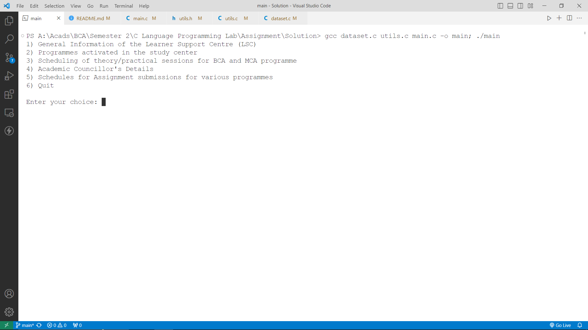
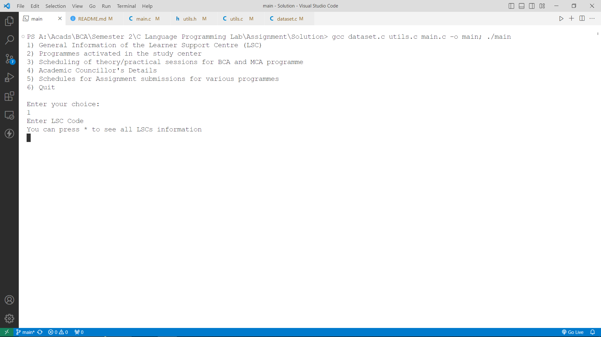
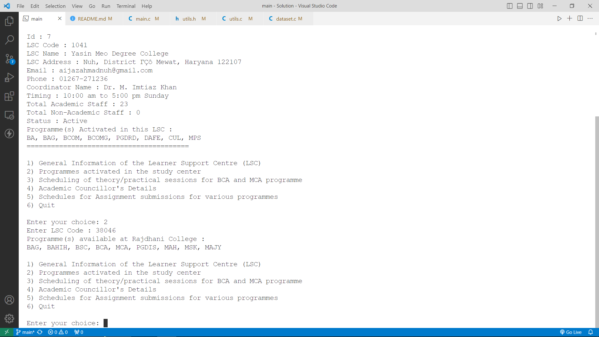
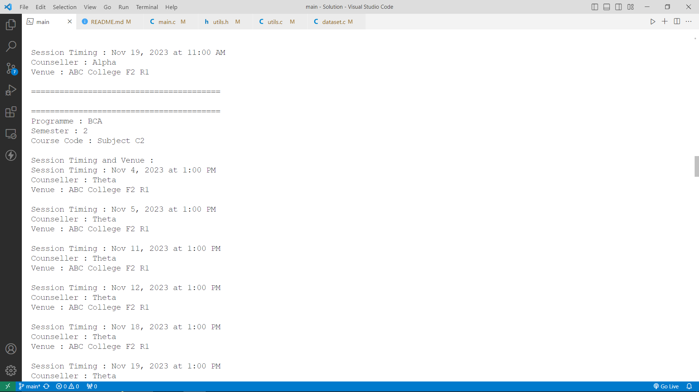

# Learner Support Desk

## This is the solution of BCA(II)/L-021/Assignment/2023-24 by Sahil (aka Sahil-4)

### Run below command(s) to compile and run this program

1. `gcc dataset.c utils.c main.c -o main`
2. `./main`

or

1. `gcc dataset.c utils.c main.c -o main; ./main;`

Note : Make sure you have gcc compiler installed in your system and you are running the command(s) in the directory where main.c dataset.c utils.h and utils.c are present

### Problem Statement :

Write an interactive C program which prompts the user with the following options on the opening menu:

1. General Information of the Learner Support Centre(LSC)
2. Programmes activated in the study center
3. Scheduling of theory/practical sessions for BCA-MCA programmes
4. Academic Councillor’s Details
5. Schedules for Assignment submissions for various programmes
6. Quit

Enter your choice:

If an “1” is entered, prompt the user to enter the study center code and know the general details about the study like name of the learner support center(LSC), name of the regional center, name of the study center coordinator, programme in-charge details etc.
If “2” is entered, it should give the details of all the programmes that are activated in the LSC.
If “3” is entered, it should give the schedules for the theory and practical counseling sessions for BCA and MCA programmes for the current session.
If “4” is entered it should display the details of the academic counselors' associated with respective programmes.
If “5” is entered it should display the assignment submission schedules for various programmes for the current session activated in that LSC.
If the user enters any letters or numbers other than the choice, redisplay the prompt.
All output should go to the terminal and all input should come from the keyboard.

### Logic :

I have divided the logic mainly into three segments

1.  [dataset](./dataset.c) - Here i have added the data related to LSCs, Counseling Schedule, Course Coordinator and Assignment Submission dates

2.  [utility file](./utils.c) - Utility file is the file where I have defined the operation which I'm using in the main file like displayGeneralInfo, displayActivatedPrograms etc. For this I have also used a header file [Utility Header File](./utils.h) in same file I have define structures also for holding data (which is defined in [dataset](./dataset.c))

3.  [main](./main.c) - Then out main file comes this is the entry point of our program the flow of program will start from here

4.  Through main.c I have provided main menu and asking user to input any option. This option I'm handing using switch case statement. If user will press 1 Case 1 will get executed and the displayGeneralInfo() function declared in utils.h and defined in utils.c will get executed. 

### Screenshots of Runtime

Running the start command to compile and execute program

Main menu/interface of program

Selected 1 To get LSCs details (Then we have been asked LSC Code or press \* to get details of all LSCs)

Entered LSC Code 1041 and got the details of this LSC

Again we have provided the main menu and being asked to choose from I selected 2 and entered LSC Code 38046 after this i got the programmes activated in this LSC

After this I choose 3 in main menu to get details of Theory/Practical Schedule

Then I returned to the main menu and choose 4 for getting details of councilors

Next from main menu I choose 5 to get details of assignment submission schedule

Here I'm pressing 6 to exit from the program

This is when I gave wrong input

